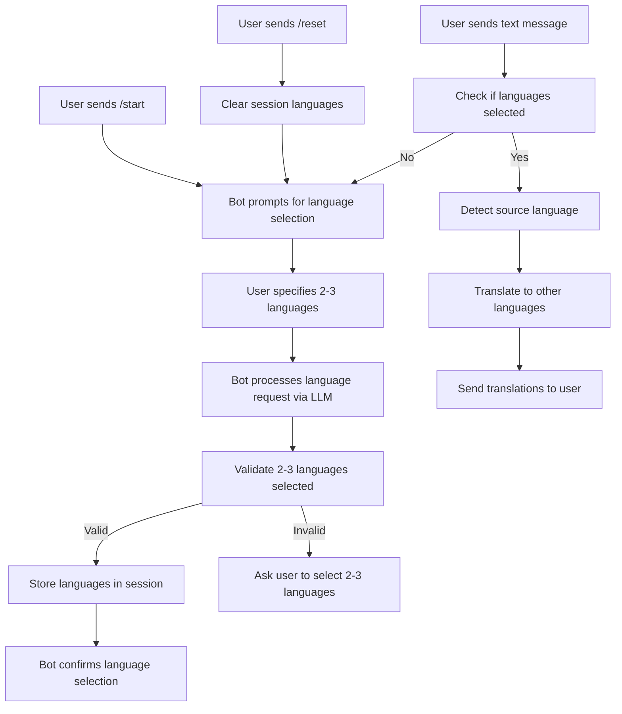

# Bot Language Selection Logic Design

## Overview

This document outlines the design for implementing the language selection logic in the Telegram translation bot. The bot should follow a specific workflow where users can select 2-3 languages for translation, and then have their messages automatically translated between those languages.

## Requirements

Based on the user requirements and analysis of the Copilot Studio implementation, the bot should function as follows:

1. When a user sends the `/start` command, the bot should initiate the language selection algorithm
2. When a user sends the `/reset` command, the bot should clear any previously selected languages and restart the language selection algorithm
3. After languages are selected, the bot should:
   - Detect the source language of incoming messages
   - Translate messages to all other selected languages
   - Skip translation if the source language matches a target language

## Current Implementation Analysis

### Telegram Bot Commands

The current implementation in `src/services/telegramBot.js` has the following commands:
- `/start` - Welcomes the user and prompts for language selection
- `/help` - Provides help information
- `/languages` - Shows currently selected languages
- `/clear` - Clears language preferences

### Translation Service Workflow

The translation service in `src/services/translationService.js` follows this workflow:
1. If no languages are set up, treat user input as language setup request
2. If languages are set up, detect source language of text
3. Translate text to each selected language (skipping same language)

### Session Management

Sessions are managed in `src/services/sessionManager.js` using an in-memory Map that stores:
- User ID
- Selected languages array
- Last active timestamp

## Design Changes Required

### 1. Command Updates

Update the Telegram bot commands to match the requirements:

#### `/start` Command
- Should trigger the language selection algorithm
- Prompt user to select 2-3 languages

#### `/reset` Command (New)
- Clear existing language preferences
- Trigger the language selection algorithm again

Note: The current `/clear` command serves the same purpose as the requested `/reset` command. We can either rename `/clear` to `/reset` or implement both commands with the same functionality.

### 2. Language Selection Validation

The language selection process needs to validate that users select exactly 2-3 languages:

1. After the LLM processes the language request and returns the languages array
2. Validate that the array contains 2-3 languages
3. If not, throw a LanguageSetupError with an appropriate message

### 3. Translation Workflow

After language selection, the bot should:
1. Receive text messages from the user
2. Detect the source language of each message
3. Translate the message to all other selected languages
4. Skip translation when source and target languages match

## Implementation Plan

### 1. Update Telegram Bot Commands

Modify `src/services/telegramBot.js` to:

a. Update the `/start` command message to clearly indicate 2-3 languages are required
b. Add a new `/reset` command that clears session and prompts for language selection

c. Update the existing `/clear` command to work the same as `/reset` or remove it in favor of `/reset`

### 2. Add Language Count Validation

Modify the `setupLanguages` method in `src/services/translationService.js` to validate the number of languages:

```javascript
// After parsing the languages response with Zod validation
if (languages.length < 2 || languages.length > 3) {
  throw new LanguageSetupError('Please select exactly 2-3 languages for translation. You selected ' + languages.length + ' languages.');
}
```

### 3. Improve User Prompts

Update prompts to clearly indicate that users should select 2-3 languages.

## Architecture Diagram



## Data Models

### Session Structure
```javascript
{
  userId: string,
  selectedLanguages: [
    {
      code: string,  // ISO 639-1 code (uppercase)
      name: string   // Full English language name
    }
  ],
  lastActive: Date
}
```

### Language Object
```javascript
{
  code: string,  // Two-letter ISO 639-1 code in uppercase
  name: string   // Full English language name with capital first letter
}
```

## Error Handling

1. **Language Selection Errors**:
   - If user selects fewer than 2 or more than 3 languages, prompt again with clear instructions
   - If LLM fails to process language request, provide clear error message

2. **Translation Errors**:
   - If language detection fails, inform user and request retry
   - If translation fails for a specific language, skip that language and continue with others

## Validation

The implementation should validate:
1. Number of selected languages (2-3)
2. Validity of language codes (ISO 639-1)
3. Proper formatting of language names

## Testing Considerations

1. Test language selection with various input formats
2. Test edge cases (1 language, 4+ languages)
3. Test translation workflow with different language combinations
4. Test session management (expiration, clearing)
5. Test both `/reset` and `/clear` commands

## Implementation Details

### Current Flow Analysis

The current implementation already follows most of the required flow:
1. When a user sends `/start`, they receive a welcome message asking for language preferences
2. The first message is treated as a language setup request
3. The LLM processes the language request and returns a structured JSON response
4. The response is validated using Zod schema
5. Languages are stored in the session
6. Subsequent messages are processed as translation requests

### Required Changes

1. **Update `/start` command message** to specify 2-3 languages are required
2. **Add `/reset` command** that clears session and prompts for language selection
3. **Add language count validation** in the `setupLanguages` method
4. **Update error messages** to be more user-friendly

### Code Modifications

#### Telegram Bot (`src/services/telegramBot.js`)

1. Update `/start` command response:
   ```javascript
   ctx.reply('Welcome to the Translation Bot! Please tell me which 2-3 languages you want to use for translation. For example: "I want to use English, Russian, and Korean"');
   ```

2. Add `/reset` command:
   ```javascript
   this.bot.command('reset', (ctx) => {
     const userId = ctx.from.id.toString();
     sessionManager.clearSession(userId);
     ctx.reply('Your language preferences have been cleared. Please tell me which 2-3 languages you want to use for translation.');
   });
   ```

#### Translation Service (`src/services/translationService.js`)

1. Add language count validation in `setupLanguages` method:
   ```javascript
   // Validate the response
   const languages = LanguagesArraySchema.parse(response);
   
   // Validate number of languages (2-3)
   if (languages.length < 2 || languages.length > 3) {
     throw new LanguageSetupError(`Please select exactly 2-3 languages for translation. You selected ${languages.length} languages.`);
   }
   ```

This approach maintains the existing architecture while adding the required validation and commands.