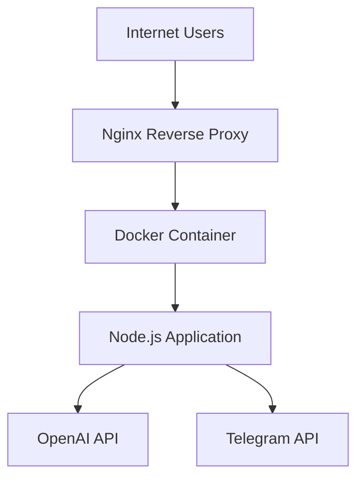

# Telegram Translation Bot Deployment Design

## 1. Overview

This document outlines the deployment design for the Telegram Translation Bot application. The bot provides real-time multilingual translation using the GPT-5-nano model via the OpenAI API, enabling users to communicate across language barriers within Telegram.

### 1.1 Deployment Goals
- Deploy the application to a remote server (31.97.173.218)
- Configure SSL certificate for domain anna.floripa.br
- Set up Docker containerization for portability
- Configure Nginx reverse proxy
- Implement proper security measures

### 1.2 System Requirements
- Server with SSH access (31.97.173.218)
- Domain name (anna.floripa.br)
- Telegram Bot Token
- OpenAI API Key

## 2. Architecture

### 2.1 Component Overview


### 2.2 Deployment Architecture
The deployment consists of the following components:
- **Nginx Reverse Proxy**: Handles SSL termination and forwards requests to the application
- **Docker Container**: Runs the Node.js application in an isolated environment
- **Node.js Application**: Core Telegram bot with translation capabilities
- **External Services**: OpenAI API for translations, Telegram API for messaging

### 2.3 Port Configuration
- **Port 80**: HTTP traffic (redirected to HTTPS)
- **Port 443**: HTTPS traffic (SSL encrypted)
- **Port 3000**: Internal application port (container port)
- **Port 3001**: Host port mapping (to avoid conflicts)

## 3. Deployment Process

### 3.1 Pre-deployment Checklist
- [ ] Verify SSH access to server (root@31.97.173.218)
- [ ] Confirm domain name (anna.floripa.br) points to server IP
- [ ] Prepare .env file with credentials
- [ ] Verify Docker and Docker Compose installation on server

### 3.2 Environment Configuration
The application requires the following environment variables:
- `PORT`: Server port (default: 3000)
- `TELEGRAM_BOT_TOKEN`: Telegram bot authentication token
- `OPENAI_API_KEY`: OpenAI API key for translation service
- `OPENAI_MODEL`: Model to use for translations (default: gpt-5-nano)
- `SESSION_EXPIRY_TIME`: Session expiration time in milliseconds (default: 86400000)
- `MAX_RETRIES`: Maximum retry attempts for API calls (default: 3)
- `BASE_DELAY`: Base delay for exponential backoff (default: 1000)

### 3.3 Deployment Steps

#### Step 1: Environment Setup
1. Create `.env` file based on `.env.example`
2. Fill in credentials:
   ```
   PORT=3000
   TELEGRAM_BOT_TOKEN=your_actual_telegram_bot_token_here
   OPENAI_API_KEY=your_actual_openai_api_key_here
   OPENAI_MODEL=gpt-5-nano
   SESSION_EXPIRY_TIME=86400000
   MAX_RETRIES=3
   BASE_DELAY=1000
   ```

#### Step 2: Server Preparation
1. Connect to server via SSH:
   ```bash
   ssh root@31.97.173.218
   ```
2. Update system packages:
   ```bash
   apt update && apt upgrade -y
   ```
3. Install required packages:
   ```bash
   apt install -y docker.io docker-compose nginx certbot python3-certbot-nginx
   ```

#### Step 3: Application Deployment
1. Copy application files to server:
   ```bash
   scp -r ./* root@31.97.173.218:/opt/telegram-translation-bot/
   ```
2. Set proper permissions:
   ```bash
   chmod 600 /opt/telegram-translation-bot/.env
   ```
3. Create logs directory:
   ```bash
   mkdir -p /opt/telegram-translation-bot/logs
   ```

#### Step 4: Nginx Configuration
1. Copy Nginx configuration:
   ```bash
   cp /opt/telegram-translation-bot/nginx.conf /etc/nginx/sites-available/telegram-translation-bot
   ```
2. Create symbolic link:
   ```bash
   ln -sf /etc/nginx/sites-available/telegram-translation-bot /etc/nginx/sites-enabled/
   ```
3. Test configuration:
   ```bash
   nginx -t
   ```
4. Reload Nginx:
   ```bash
   systemctl reload nginx
   ```

#### Step 5: SSL Certificate Setup
1. Obtain SSL certificate:
   ```bash
   certbot --nginx -d anna.floripa.br --non-interactive --agree-tos --email admin@anna.floripa.br
   ```

#### Step 6: Docker Container Deployment
1. Navigate to application directory:
   ```bash
   cd /opt/telegram-translation-bot
   ```
2. Build and start containers:
   ```bash
   docker-compose up -d
   ```

### 3.4 Automated Deployment Scripts

#### deploy.sh (Linux/Mac)
The project includes an automated deployment script for Linux/Mac environments:
```bash
chmod +x deploy.sh
./deploy.sh
```

#### deploy.ps1 (Windows)
For Windows environments, use the PowerShell script:
```powershell
.\deploy.ps1
```

## 4. Security Considerations

### 4.1 Credential Management
- Environment variables stored in `.env` file with restricted permissions (600)
- No credentials hardcoded in source code
- Use of non-root user inside Docker container

### 4.2 Network Security
- Nginx reverse proxy for request handling
- SSL encryption for all external communications
- Port mapping limited to necessary ports only

### 4.3 Container Security
- Running application as non-root user inside container
- Minimal base image (Alpine Linux)
- Only production dependencies installed

## 5. Monitoring and Maintenance

### 5.1 Health Checks
- Application exposes health endpoint
- Monitor container status with `docker-compose ps`
- Check logs with `docker-compose logs`

### 5.2 Log Management
- Application logs stored in `/opt/telegram-translation-bot/logs/`
- Docker logs accessible via `docker-compose logs`
- Nginx logs in `/var/log/nginx/`

### 5.3 SSL Certificate Renewal
- Certbot automatically sets up renewal cron job
- Test renewal with `certbot renew --dry-run`

### 5.4 Application Updates
1. Pull latest code from repository
2. Rebuild Docker image: `docker-compose build`
3. Restart containers: `docker-compose up -d`

## 6. Troubleshooting

### 6.1 Common Issues

#### Port Conflicts
If encountering port conflicts:
1. Check if port 3000 is in use:
   ```bash
   lsof -i :3000
   ```
2. Stop conflicting processes or change port mapping in `docker-compose.yml`

#### Bot Not Responding
1. Verify Telegram token validity
2. Check container logs:
   ```bash
   docker-compose logs telegram-bot
   ```

#### Translation Failures
1. Verify OpenAI API key and quota
2. Check network connectivity to OpenAI API

#### SSL Errors
1. Verify certificate validity
2. Check renewal status

### 6.2 Diagnostic Commands
- Check container status: `docker-compose ps`
- View application logs: `docker-compose logs -f`
- Test health endpoint: `curl -k https://anna.floripa.br/health`
- Check Nginx configuration: `nginx -t`

## 7. Rollback Procedure

If deployment fails:
1. Stop current containers:
   ```bash
   docker-compose down
   ```
2. Restore previous version from backup
3. Re-deploy with corrected configuration

## 8. Post-Deployment Verification

After deployment, verify the following:
- [ ] Application is running: `docker-compose ps`
- [ ] Nginx is serving requests on port 443
- [ ] SSL certificate is valid
- [ ] Telegram bot responds to commands
- [ ] Translation functionality works
- [ ] Logs are being generated correctly