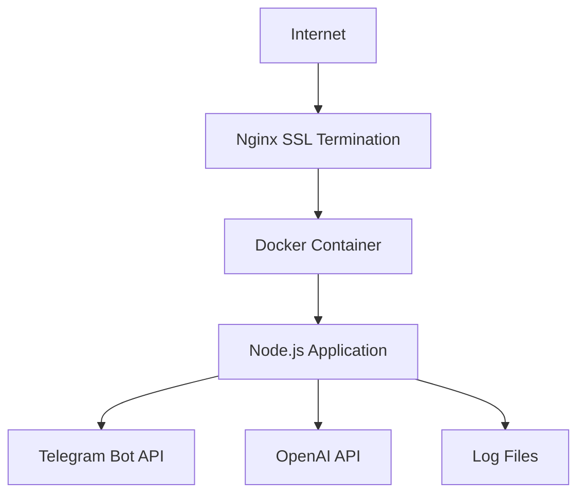

# Production Deployment Design for Telegram Translation Bot

## 1. Overview

This document outlines the design for deploying the Telegram Translation Bot application to production. The application is a Node.js service that provides real-time translation services via Telegram using the OpenAI GPT-5-nano model. The deployment architecture uses Docker containerization with Nginx as a reverse proxy and SSL termination.

### 1.1 System Requirements

- Node.js 18 (via Docker)
- Docker and Docker Compose
- Nginx for reverse proxy
- SSL certificate (Let's Encrypt)
- Server with SSH access (31.97.173.218)

### 1.2 Key Features

- Containerized deployment using Docker
- Reverse proxy with Nginx
- SSL encryption with Let's Encrypt
- Persistent logging to host filesystem
- Automatic restart policy
- Health check endpoints

## 2. Architecture

### 2.1 Deployment Architecture



### 2.2 Component Description

1. **Nginx Reverse Proxy**: Handles SSL termination and forwards requests to the application container
2. **Docker Container**: Runs the Node.js application in an isolated environment
3. **Node.js Application**: Core Telegram translation bot service
4. **Log Files**: Persistent storage for application logs on the host system

## 3. Deployment Process

### 3.1 Prerequisites

Before deployment, ensure the following prerequisites are met:

1. Server with SSH access (31.97.173.218)
2. Domain name configured (anna.floripa.br)
3. Telegram Bot Token
4. OpenAI API Key

### 3.2 Environment Configuration

Create a `.env` file with the following variables:

```env
# Server Configuration
PORT=3000

# Telegram Bot Configuration
TELEGRAM_BOT_TOKEN=your_actual_telegram_bot_token_here

# OpenAI Configuration
OPENAI_API_KEY=your_actual_openai_api_key_here
OPENAI_MODEL=gpt-5-turbo

# Session Configuration
SESSION_EXPIRY_TIME=86400000

# Retry Configuration
MAX_RETRIES=3
BASE_DELAY=1000
```

### 3.3 Deployment Steps

#### Step 1: Prepare Server Environment

```bash
# Update system packages
apt update && apt upgrade -y

# Install required packages
apt install -y docker.io docker-compose nginx certbot python3-certbot-nginx
```

#### Step 2: Transfer Application Files

Transfer all application files to the server:

```bash
# Create deployment directory
mkdir -p /opt/telegram-translation-bot

# Copy application files (via scp or similar)
scp -r ./* root@31.97.173.218:/opt/telegram-translation-bot/
```

#### Step 3: Configure Environment

```bash
# Set proper permissions for environment file
chmod 600 /opt/telegram-translation-bot/.env

# Create logs directory
mkdir -p /opt/telegram-translation-bot/logs
```

#### Step 4: Configure Nginx

```bash
# Copy Nginx configuration
cp /opt/telegram-translation-bot/nginx.conf /etc/nginx/sites-available/telegram-translation-bot

# Enable the site
ln -sf /etc/nginx/sites-available/telegram-translation-bot /etc/nginx/sites-enabled/

# Test configuration
nginx -t

# Reload Nginx
systemctl reload nginx
```

#### Step 5: Obtain SSL Certificate

```bash
# Obtain SSL certificate
certbot --nginx -d anna.floripa.br --non-interactive --agree-tos --email admin@anna.floripa.br
```

#### Step 6: Start Application

```bash
# Navigate to application directory
cd /opt/telegram-translation-bot

# Start Docker containers
docker-compose up -d
```

## 4. Docker Configuration

### 4.1 Dockerfile

The Dockerfile defines the container image for the application:

```dockerfile
# Use Node.js 18 as the base image
FROM node:18-alpine

# Set the working directory
WORKDIR /app

# Copy package files for dependency installation
COPY package*.json ./

# Install production dependencies only
RUN npm ci --only=production

# Copy application code
COPY . .

# Create logs directory
RUN mkdir -p logs

# Expose application port
EXPOSE 3000

# Create non-root user for security
RUN addgroup -g 1001 -S nodejs
RUN adduser -S nextjs -u 1001

# Change ownership to non-root user
RUN chown -R nextjs:nodejs /app
USER nextjs

# Start application
CMD ["npm", "start"]
```

### 4.2 Docker Compose

The docker-compose.yml file defines the container configuration:

```yaml
version: '3.8'

services:
  telegram-bot:
    build: .
    container_name: telegram-translation-bot
    ports:
      - "3000:3000"
    env_file:
      - .env
    volumes:
      - ./logs:/app/logs
    restart: unless-stopped
```

## 5. Nginx Configuration

The Nginx configuration handles SSL termination and reverse proxying:

```nginx
server {
    listen 80;
    server_name anna.floripa.br;
    return 301 https://$server_name$request_uri;
}

server {
    listen 443 ssl;
    server_name anna.floripa.br;

    ssl_certificate /etc/letsencrypt/live/anna.floripa.br/fullchain.pem;
    ssl_certificate_key /etc/letsencrypt/live/anna.floripa.br/privkey.pem;

    location / {
        proxy_pass http://localhost:3000;
        proxy_http_version 1.1;
        proxy_set_header Upgrade $http_upgrade;
        proxy_set_header Connection 'upgrade';
        proxy_set_header Host $host;
        proxy_set_header X-Real-IP $remote_addr;
        proxy_set_header X-Forwarded-For $proxy_add_x_forwarded_for;
        proxy_set_header X-Forwarded-Proto $scheme;
        proxy_cache_bypass $http_upgrade;
        proxy_read_timeout 86400;
    }
}
```

## 6. Logging Configuration

### 6.1 Log Structure

The application uses Winston for logging with the following configuration:

1. Error logs: `/app/logs/error.log`
2. Combined logs: `/app/logs/combined.log`

### 6.2 Log Persistence

Logs are persisted to the host filesystem through Docker volume mapping:

```yaml
volumes:
  - ./logs:/app/logs
```

This ensures logs survive container restarts and can be accessed directly on the host system.

## 7. Monitoring and Health Checks

### 7.1 Health Check Endpoint

The application exposes a health check endpoint at `/health` which returns:

```json
{
  "status": "ok",
  "timestamp": "2023-XX-XXTXX:XX:XX.XXXZ",
  "uptime": 123.456,
  "sessions": 5
}
```

### 7.2 Container Monitoring

Monitor container status with:

```bash
docker-compose ps
```

### 7.3 Log Monitoring

Monitor application logs with:

```bash
docker-compose logs -f
```

## 8. Security Considerations

1. **Non-root User**: Application runs as a non-root user inside the container
2. **Environment File Permissions**: Environment file has restricted permissions (600)
3. **SSL Encryption**: All external communications are encrypted
4. **Dependency Management**: Uses `npm ci` for reproducible builds

## 9. Maintenance Procedures

### 9.1 Updating the Application

To update the application:

1. Stop current containers: `docker-compose down`
2. Update application files
3. Rebuild and start: `docker-compose up -d --build`

### 9.2 SSL Certificate Renewal

Let's Encrypt certificates are automatically renewed by Certbot.

### 9.3 Log Management

Regularly rotate logs to prevent disk space issues:

```bash
logrotate /etc/logrotate.d/telegram-bot
```

## 10. Troubleshooting

### 10.1 Common Issues

1. **Port Conflicts**: If port 3000 is in use, either stop the conflicting process or change the port mapping
2. **SSL Certificate Issues**: Verify domain name resolution and certificate paths
3. **Environment Variables**: Ensure all required environment variables are set in the .env file

### 10.2 Diagnostic Commands

1. Check container status: `docker-compose ps`
2. View logs: `docker-compose logs`
3. Test health endpoint: `curl https://anna.floripa.br/health`
4. Check Nginx configuration: `nginx -t`