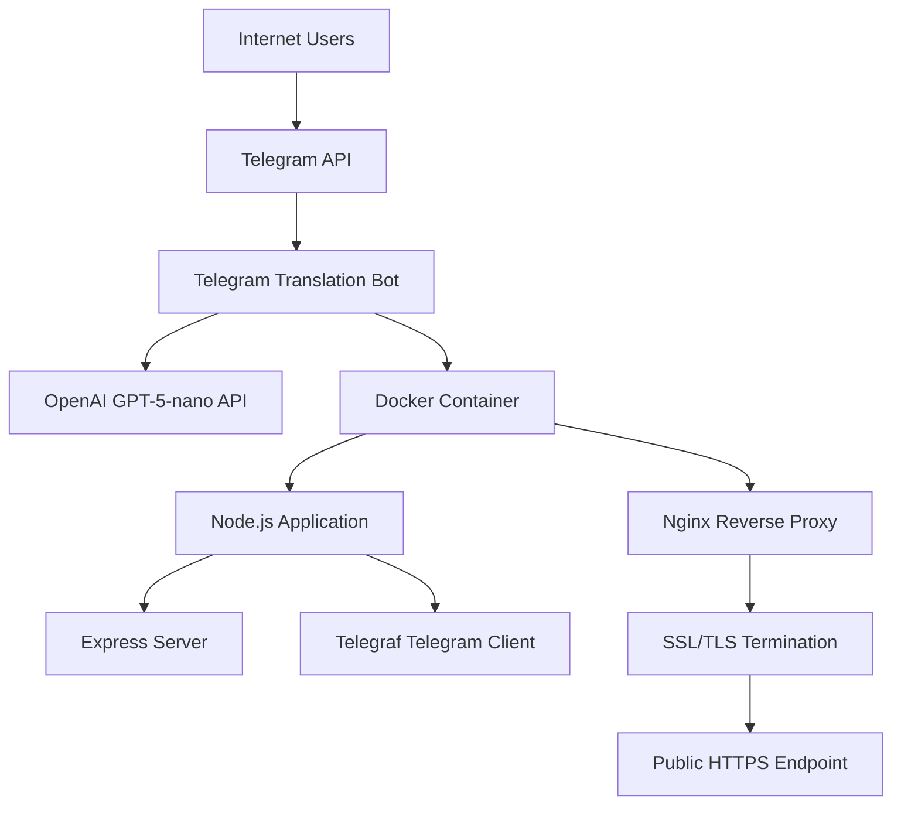
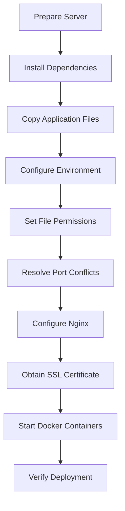

# Telegram Translation Bot Deployment Design

## 1. Overview

This document outlines the deployment design for the Telegram Translation Bot application. The bot provides real-time multilingual translation using the GPT-5-nano model via the OpenAI API, enabling users to communicate across language barriers directly within Telegram.

### Key Features
- Real-time translation between English, Russian, and Korean
- Telegram bot integration with commands (/start, /help, /languages, /clear)
- Session-based language preference storage
- Dockerized deployment for portability and scalability
- SSL-enabled web server configuration

## 2. Deployment Architecture

### 2.1 System Components


### 2.2 Deployment Stack
- **Container Platform**: Docker with Docker Compose
- **Web Server**: Nginx (reverse proxy with SSL)
- **Application Runtime**: Node.js 18 (Alpine Linux)
- **Process Management**: Docker restart policies
- **SSL Management**: Let's Encrypt via Certbot

## 3. Prerequisites

### 3.1 Server Requirements
- Linux server (Ubuntu/Debian recommended)
- SSH access with root privileges
- Public IP address (31.97.173.218)
- Domain name configured (anna.floripa.br)

### 3.2 Required Services
- Docker and Docker Compose
- Nginx
- Certbot for SSL certificates

### 3.3 Credentials
- Telegram Bot Token
- OpenAI API Key

## 4. Deployment Process

### 4.1 Environment Configuration
1. Create `.env` file based on `.env.example`
2. Configure required environment variables:
   ```
   TELEGRAM_BOT_TOKEN=your_actual_bot_token
   OPENAI_API_KEY=your_openai_api_key
   ```

### 4.2 Deployment Steps


### 4.3 Detailed Deployment Sequence

#### Step 1: Server Preparation
- Update system packages
- Install required software (Docker, Docker Compose, Nginx, Certbot)

#### Step 2: Application Deployment
- Create deployment directory (`/opt/telegram-translation-bot`)
- Copy application files to server
- Set proper permissions for sensitive files

#### Step 3: Port Conflict Resolution
- Check if port 3000 is in use
- Stop conflicting processes or containers if necessary

#### Step 4: Web Server Configuration
- Copy Nginx configuration
- Enable site configuration
- Test Nginx configuration

#### Step 5: SSL Certificate Setup
- Obtain SSL certificate using Certbot
- Configure automatic renewal

#### Step 6: Application Startup
- Build Docker images
- Start containers in detached mode
- Verify container health

## 5. Configuration Files

### 5.1 Docker Compose Configuration
```yaml
version: '3.8'
services:
  telegram-bot:
    build: .
    container_name: telegram-translation-bot
    ports:
      - "3000:3000"
    env_file:
      - .env
    volumes:
      - ./logs:/app/logs
    restart: unless-stopped
```

### 5.2 Nginx Configuration (Key Elements)
- Server block for domain `anna.floripa.br`
- SSL configuration with Let's Encrypt certificates
- Proxy pass to Docker container on port 3000
- Security headers and optimizations

### 5.3 Environment Variables
| Variable | Description | Default |
|----------|-------------|---------|
| PORT | Application port | 3000 |
| TELEGRAM_BOT_TOKEN | Telegram bot API token | Required |
| OPENAI_API_KEY | OpenAI API key | Required |
| OPENAI_MODEL | OpenAI model to use | gpt-5-turbo |
| SESSION_EXPIRY_TIME | Session expiration (ms) | 86400000 |
| MAX_RETRIES | API retry attempts | 3 |
| BASE_DELAY | Retry delay base (ms) | 1000 |

## 6. Monitoring and Maintenance

### 6.1 Health Checks
- Built-in `/health` endpoint
- Docker container status monitoring
- Log file monitoring

### 6.2 Log Management
- Application logs stored in `./logs` directory
- Docker log rotation
- Nginx access and error logs

### 6.3 Restart Policies
- Docker `unless-stopped` policy ensures automatic restart
- Graceful shutdown handling in application code

## 7. Security Considerations

### 7.1 Container Security
- Non-root user execution inside container
- Minimal Alpine Linux base image
- Production-only dependencies

### 7.2 Network Security
- SSL/TLS encryption for all external traffic
- Reverse proxy isolation
- Limited exposed ports

### 7.3 Credential Security
- Environment variables for sensitive data
- Proper file permissions (600) for `.env` file
- No credentials stored in source code

## 8. Troubleshooting

### 8.1 Common Issues
| Issue | Solution |
|-------|----------|
| Port conflicts | Use provided conflict resolution |
| SSL certificate errors | Verify domain DNS settings |
| Container fails to start | Check logs with `docker-compose logs` |
| Bot not responding | Verify Telegram token validity |

### 8.2 Diagnostic Commands
- Check container status: `docker-compose ps`
- View logs: `docker-compose logs -f`
- Health check: `curl https://anna.floripa.br/health`
- Container shell access: `docker-compose exec telegram-bot sh`

## 9. Post-Deployment Verification

### 9.1 Verification Steps
1. Confirm Docker containers are running
2. Test health endpoint response
3. Validate SSL certificate
4. Test Telegram bot functionality

### 9.2 Success Criteria
- [ ] Application responds to health checks
- [ ] Telegram bot accepts commands
- [ ] Translation functionality works
- [ ] SSL certificate is valid
- [ ] Logs show normal operation