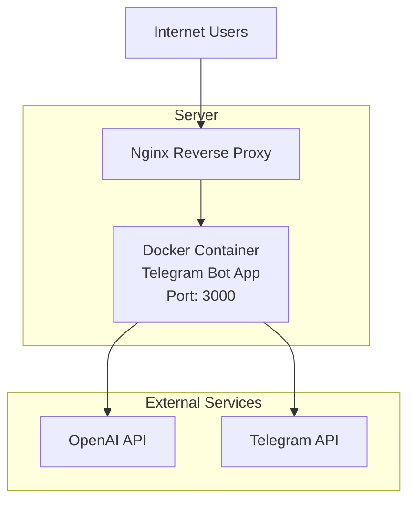
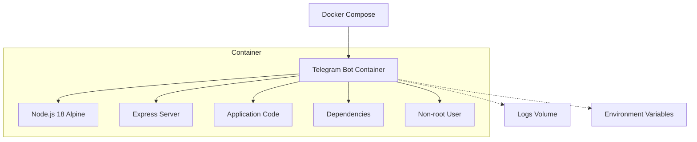
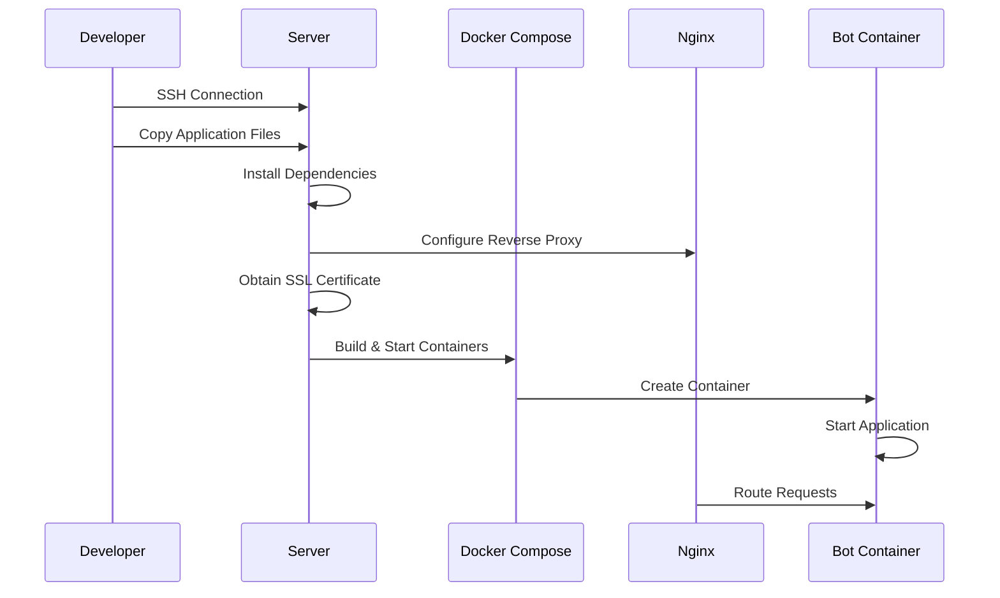

# Docker Deployment Design for Telegram Translation Bot

## 1. Overview

This document outlines the deployment architecture and process for the Telegram Translation Bot using Docker containers. The solution addresses previous deployment issues by implementing flexible port configuration, robust environment management, and streamlined deployment processes.

### 1.1 Purpose
- Containerize the Telegram Translation Bot application for consistent deployment
- Resolve previous port conflict issues through environment variable configuration
- Implement secure deployment with proper SSL termination via Nginx reverse proxy
- Provide automated deployment scripts for consistent server provisioning

### 1.2 Key Components
- **Telegram Translation Bot Application**: Node.js application with Express server
- **Docker Container**: Isolated runtime environment for the application
- **Docker Compose**: Orchestration for container deployment
- **Nginx Reverse Proxy**: SSL termination and request routing
- **SSL Certificate**: Secure HTTPS communication using Let's Encrypt

## 2. Architecture

### 2.1 System Architecture Diagram



### 2.2 Docker Architecture



### 2.3 Deployment Flow



## 3. Docker Configuration

### 3.1 Dockerfile Design

The Dockerfile implements security best practices and efficient layering:

```dockerfile
# Use Node.js 18 as the base image
FROM node:18-alpine

# Set the working directory
WORKDIR /app

# Copy package files for dependency installation
COPY package*.json ./

# Install production dependencies only
RUN npm ci --only=production

# Copy application code
COPY . .

# Create logs directory
RUN mkdir -p logs

# Expose application port
EXPOSE 3000

# Create non-root user for security
RUN addgroup -g 1001 -S nodejs
RUN adduser -S nextjs -u 1001

# Change ownership to non-root user
RUN chown -R nextjs:nodejs /app
USER nextjs

# Start application
CMD ["npm", "start"]
```

Key features:
- Uses lightweight Alpine Linux base image
- Installs only production dependencies with `npm ci`
- Runs as non-root user for security
- Creates dedicated logs directory

### 3.2 Docker Compose Configuration

The docker-compose.yml implements flexible port configuration to prevent conflicts:

```yaml
version: '3.8'

services:
  telegram-bot:
    build: .
    container_name: telegram-translation-bot
    ports:
      - "${HOST_PORT:-3000}:${CONTAINER_PORT:-3000}"
    env_file:
      - .env
    volumes:
      - ./logs:/app/logs
    restart: unless-stopped
```

Features:
- Environment variable-based port mapping
- Volume mounting for persistent logs
- Automatic restart policy
- Environment file integration

## 4. Environment Configuration

### 4.1 Environment Variables

The application requires the following environment variables defined in `.env`:

| Variable | Description | Default |
|----------|-------------|---------|
| PORT | Application port | 3000 |
| TELEGRAM_BOT_TOKEN | Telegram bot authentication token | None |
| OPENAI_API_KEY | OpenAI API key for translations | None |
| OPENAI_MODEL | OpenAI model to use | gpt-5-turbo |
| SESSION_EXPIRY_TIME | Session expiration time (ms) | 86400000 |
| MAX_RETRIES | Max retry attempts for API calls | 3 |
| BASE_DELAY | Base delay for retry backoff (ms) | 1000 |
| HOST_PORT | Host port mapping | 3000 |
| CONTAINER_PORT | Container port mapping | 3000 |

### 4.2 Environment File Security

Security measures for environment files:
- File permissions set to 600 (owner read/write only)
- Not included in version control (gitignored)
- Example provided in `.env.example`

## 5. Nginx Configuration

### 5.1 Reverse Proxy Setup

Nginx is configured as a reverse proxy with SSL termination:

```nginx
server {
    listen 80;
    server_name anna.floripa.br;
    return 301 https://$server_name$request_uri;
}

server {
    listen 443 ssl;
    server_name anna.floripa.br;

    ssl_certificate /etc/letsencrypt/live/anna.floripa.br/fullchain.pem;
    ssl_certificate_key /etc/letsencrypt/live/anna.floripa.br/privkey.pem;

    location / {
        proxy_pass http://localhost:3001;
        proxy_http_version 1.1;
        proxy_set_header Upgrade $http_upgrade;
        proxy_set_header Connection 'upgrade';
        proxy_set_header Host $host;
        proxy_set_header X-Real-IP $remote_addr;
        proxy_set_header X-Forwarded-For $proxy_add_x_forwarded_for;
        proxy_set_header X-Forwarded-Proto $scheme;
        proxy_cache_bypass $http_upgrade;
        proxy_read_timeout 86400;
    }
}
```

Features:
- Automatic HTTP to HTTPS redirect
- SSL certificate configuration
- WebSocket support for Telegram bot
- Proper proxy headers for application context
- Extended timeout for long-running operations

## 6. Deployment Process

### 6.1 Automated Deployment Script

The deployment process is automated through shell scripts:

```bash
#!/bin/bash

# Key deployment steps:
# 1. Validate environment configuration
# 2. Create deployment directory on server
# 3. Copy application files
# 4. Install system dependencies
# 5. Configure file permissions
# 6. Resolve port conflicts
# 7. Configure Nginx reverse proxy
# 8. Obtain SSL certificate
# 9. Start Docker containers
```

### 6.2 Port Conflict Resolution

The deployment script includes automatic port conflict resolution:

1. Check if configured port is in use
2. Identify conflicting processes or containers
3. Stop conflicting Docker containers or kill processes
4. Wait for port to be released before proceeding

### 6.3 SSL Certificate Management

Let's Encrypt SSL certificates are automatically:
- Requested during deployment
- Renewed through Certbot's automatic cron job
- Tested with `certbot renew --dry-run`

## 7. Monitoring and Maintenance

### 7.1 Health Checks

The application exposes a health check endpoint at `/health` which returns:

```json
{
  "status": "ok",
  "timestamp": "2023-05-15T10:30:00.000Z",
  "uptime": 3600.5,
  "sessions": 15
}
```

### 7.2 Log Management

Logging strategy:
- Application logs written to `/app/logs` directory
- Logs persisted through Docker volume mounting
- Docker container logs accessible via `docker-compose logs`
- Nginx logs stored in standard locations

### 7.3 Container Management

Key Docker commands for maintenance:
- `docker-compose ps` - Check container status
- `docker-compose logs -f` - View live logs
- `docker-compose restart` - Restart containers
- `docker-compose down` - Stop and remove containers

## 8. Security Considerations

### 8.1 Container Security

- Application runs as non-root user inside container
- Only production dependencies installed
- Minimal base image (Alpine Linux) reduces attack surface

### 8.2 Network Security

- SSL encryption for all external communications
- Reverse proxy isolates application from direct internet access
- Proper firewall configuration recommended

### 8.3 Credential Security

- Environment variables stored with restricted permissions (600)
- Credentials not hardcoded in source code
- Sensitive files excluded from version control

## 9. Troubleshooting

### 9.1 Common Issues and Solutions

| Issue | Solution |
|-------|----------|
| Port conflicts | Use environment variables to change port mapping |
| Bot not responding | Verify Telegram token validity |
| Translation failures | Check OpenAI API key and quota |
| SSL errors | Verify certificate validity and renewal |
| Container won't start | Check logs with `docker-compose logs` |

### 9.2 Diagnostic Commands

```bash
# Check if port is in use
netstat -tulpn | grep :3000

# View Docker container logs
docker-compose logs

# Check container status
docker-compose ps

# Test Nginx configuration
nginx -t

# Test SSL certificate renewal
certbot renew --dry-run
```

## 10. Testing and Validation

### 10.1 Deployment Verification Script

A verification script checks all essential deployment components:

1. Essential files existence
2. Dockerfile content validation
3. Docker Compose configuration
4. Nginx configuration
5. Environment variable setup
6. Deployment script content

### 10.2 Post-Deployment Validation

After deployment, verify:
- Application responds to health check endpoint
- Telegram bot responds to messages
- SSL certificate is valid
- Logs are being generated
- Container is running with correct restart policy

## 11. Future Enhancements

### 11.1 Scalability Improvements
- Implement load balancing for multiple container instances
- Add Redis for shared session storage
- Implement container orchestration with Kubernetes

### 11.2 Monitoring Enhancements
- Add application performance monitoring
- Implement centralized log aggregation
- Add alerting for critical failures

### 11.3 Security Enhancements
- Implement rate limiting
- Add intrusion detection
- Regular security scanning of container images
```