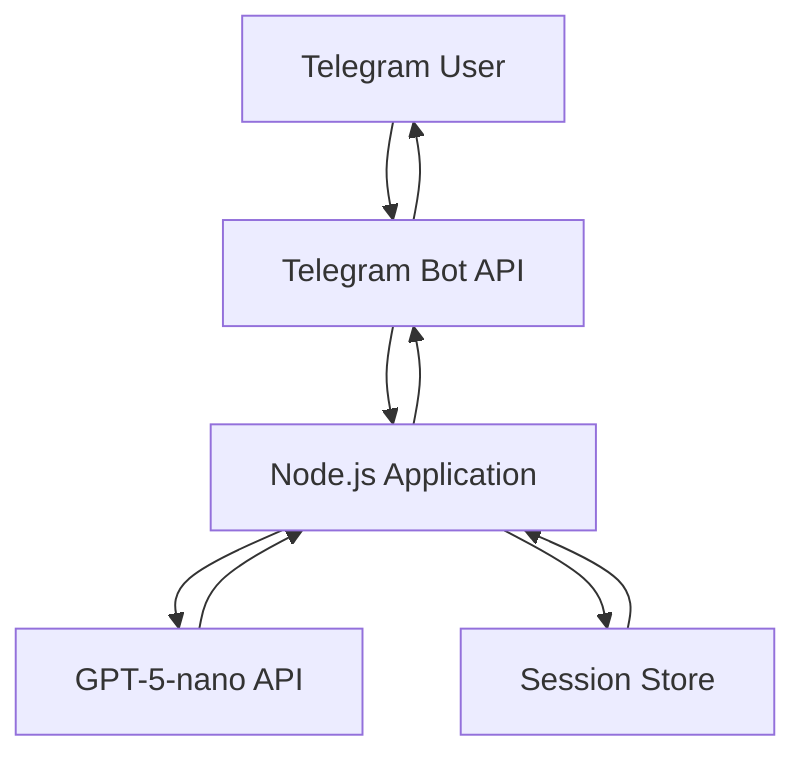

# Node.js Translation Bot Project Design

## 1. Overview

This document outlines the technical design for migrating the T.Buddy translation bot from Copilot Studio to a self-hosted Node.js application. The system will provide real-time translation services across multiple languages using the GPT-5-nano model, supporting up to 100 concurrent users with cost-effective infrastructure.

### 1.1 Project Goals
- Migrate core functionality from Copilot Studio to Node.js
- Implement robust LLM response handling and validation
- Design scalable session management for user language preferences
- Optimize for cost-effectiveness using GPT-5-nano model
- Support Telegram integration for user interactions

### 1.2 Key Requirements
- Support for English, Russian, and Korean languages (based on user preferences)
- Three-stage translation pipeline: language setup, source language detection, and translation
- JSON validation and error handling for LLM responses
- Session persistence for user language preferences
- Cost optimization for LLM API usage

## 2. Technology Stack

### 2.1 Backend Framework
- **Express.js**: Lightweight web framework for creating REST APIs and handling HTTP requests
- **Node.js**: JavaScript runtime for building scalable network applications

### 2.2 LLM Integration
- **GPT-5-nano**: Primary LLM for all translation tasks due to its cost-effectiveness and low latency
  - Input: $0.05/million tokens
  - Output: $0.40/million tokens
- **OpenAI SDK**: Official library for interacting with OpenAI APIs
- **Streaming API**: For real-time translation responses to improve perceived performance

### 2.3 Session Management
- **In-memory storage**: Using JavaScript Map for development and small-scale production (up to 100 users)
- **express-session**: Middleware for managing user sessions
- **Future scalability**: Redis integration for larger deployments

### 2.4 Data Validation
- **Zod**: TypeScript-first schema declaration and validation library for JSON response validation
- **json-repair**: Library for automatically fixing common JSON syntax errors from LLM responses

### 2.5 Telegram Integration
- **Telegraf**: Modern Telegram bot framework for Node.js with comprehensive API support
- **Webhook support**: For efficient message handling

### 2.6 Utilities
- **dotenv**: Environment variable management for API keys and configuration
- **winston**: Logging framework for debugging and monitoring
- **axios**: HTTP client for external API calls

### 2.7 Development & Deployment
- **nodemon**: Development tool for automatic server restarts
- **Docker**: Containerization for consistent deployment
- **Vercel/Render**: Cost-effective hosting platforms for small applications

## 3. System Architecture

### 3.1 High-Level Architecture



### 3.2 Component Architecture

#### 3.2.1 Core Modules
1. **Telegram Service**: Handles incoming messages and outgoing responses
2. **Session Manager**: Manages user language preferences and conversation state
3. **LLM Client**: Interfaces with GPT-5-nano API with retry logic and error handling
4. **Translation Service**: Implements the three-stage translation pipeline
5. **Validation Service**: Validates and sanitizes LLM responses

#### 3.2.2 Data Flow
1. User sends message to Telegram bot
2. Telegram service receives message via webhook
3. Session manager retrieves user's language preferences
4. Translation service determines processing pipeline stage:
   - Language setup if no preferences exist
   - Source language detection for new text
   - Translation if languages are configured
5. LLM client calls GPT-5-nano with appropriate prompt
6. Validation service processes and validates LLM response
7. Response is sent back to user via Telegram

## 4. Core Services Implementation

### 4.1 Translation Service

#### 4.1.1 Language Setup (LanguageProcessor)
- **Purpose**: Convert natural language language requests to structured JSON
- **Input**: User's natural language request (e.g., "I want to use Russian, English, and maybe Japanese")
- **Process**:
  1. Use few-shot prompting with examples
  2. Request structured JSON output with specific schema
  3. Validate response with Zod schema
- **Output**: Array of language objects with ISO codes and names

#### 4.1.2 Source Language Detection (sourceLanguageCode)
- **Purpose**: Identify the language of text to be translated
- **Input**: Text to be translated
- **Process**:
  1. Use zero-shot prompting to identify language
  2. Request only two-letter ISO code
  3. Validate response format
- **Output**: Two-letter ISO 639-1 language code

#### 4.1.3 Translation (FinalTranslator)
- **Purpose**: Translate text between specified languages
- **Input**: Text to translate and target language code
- **Process**:
  1. Use direct translation prompting
  2. Request only translated text without prefixes
  3. Stream response for better UX
- **Output**: Translated text

### 4.2 Session Management

#### 4.2.1 In-Memory Implementation
```javascript
class SessionManager {
  constructor() {
    this.sessions = new Map();
  }
  
  getSession(userId) {
    return this.sessions.get(userId) || { selectedLanguages: [] };
  }
  
  setSession(userId, sessionData) {
    this.sessions.set(userId, sessionData);
  }
  
  clearSession(userId) {
    this.sessions.delete(userId);
  }
}
```

#### 4.2.2 Session Data Structure
```javascript
{
  userId: string,
  selectedLanguages: [
    {
      code: "EN",
      name: "English"
    },
    {
      code: "RU", 
      name: "Russian"
    }
  ],
  lastActive: Date
}
```

### 4.3 LLM Client with Error Handling

#### 4.3.1 Multi-Layered Response Validation
1. **Prompt Engineering**: Use explicit schema definitions and few-shot examples
2. **Model Features**: Utilize JSON mode when available
3. **Application-Level Validation**: 
   - Try-catch around JSON.parse()
   - Extract JSON from markdown code blocks
   - Use json-repair for syntax error correction
4. **Retry Logic**: Exponential backoff for persistent errors

#### 4.3.2 Retry Strategy
```javascript
async function callLLMWithRetry(prompt, maxRetries = 3) {
  for (let i = 0; i < maxRetries; i++) {
    try {
      const response = await llmClient.call(prompt);
      const validatedResponse = validateAndRepairJSON(response);
      return validatedResponse;
    } catch (error) {
      if (i === maxRetries - 1) throw error;
      // Exponential backoff
      await sleep(Math.pow(2, i) * 1000);
    }
  }
}
```

## 5. API Endpoints

### 5.1 Telegram Webhook Endpoint
- **Endpoint**: `/webhook/telegram`
- **Method**: POST
- **Purpose**: Receive messages from Telegram Bot API
- **Authentication**: Token-based verification

### 5.2 Health Check Endpoint
- **Endpoint**: `/health`
- **Method**: GET
- **Purpose**: System status monitoring
- **Response**: `{ status: 'ok', timestamp: Date }`

## 6. Data Models

### 6.1 Language Schema (Zod)
```javascript
const LanguageSchema = z.object({
  code: z.string().length(2).toUpperCase(),
  name: z.string()
});

const LanguagesArraySchema = z.array(LanguageSchema);
```

### 6.2 Session Schema
```javascript
const SessionSchema = z.object({
  userId: z.string(),
  selectedLanguages: z.array(LanguageSchema),
  lastActive: z.date()
});
```

## 7. Error Handling & Monitoring

### 7.1 Error Categories
1. **LLM Response Errors**: Malformed JSON, unexpected format
2. **API Errors**: Network issues, rate limiting, authentication
3. **Validation Errors**: Schema mismatches, missing data
4. **Session Errors**: Expired sessions, missing preferences

### 7.2 Logging Strategy
- **Info Level**: User interactions, successful translations
- **Warn Level**: Retry attempts, minor validation issues
- **Error Level**: Failed API calls, persistent validation errors

## 8. Performance Optimization

### 8.1 LLM Usage Optimization
- Use GPT-5-nano for all pipeline stages for consistency and cost savings
- Implement response streaming for translation stage
- Add caching for frequently translated phrases

### 8.2 Response Time Improvements
- Pre-populate prompts to guide model responses
- Use connection pooling for API calls
- Implement lazy session loading

## 9. Security Considerations

### 9.1 API Key Management
- Store keys in environment variables using dotenv
- Never commit keys to version control
- Rotate keys periodically

### 9.2 Input Sanitization
- Validate all user inputs
- Limit message length to prevent abuse
- Sanitize special characters in prompts

### 9.3 Rate Limiting
- Implement request throttling per user
- Monitor for unusual activity patterns
- Set reasonable limits based on expected usage

## 10. Deployment Strategy

### 10.1 Development Environment
- Local Node.js server with nodemon
- In-memory session storage
- Console logging

### 10.2 Production Deployment
- Docker containerization
- Vercel or Render hosting
- Health check monitoring
- Structured logging

### 10.3 Scaling Considerations
- Initial deployment: Single instance supporting 100 users
- Future expansion: Redis for session storage
- Load balancing for higher user counts

## 11. Cost Analysis

### 11.1 LLM API Costs (per translation)
| Stage | Model | Input Tokens | Output Tokens | Cost |
|-------|-------|--------------|---------------|------|
| Language Setup | GPT-5-nano | 150 | 50 | ~$0.0000095 |
| Source Detection | GPT-5-nano | 100 | 10 | ~$0.000009 |
| Translation | GPT-5-nano | 100 | 70 | ~$0.000033 |
| **Total** | | | | **~$0.0000515** |

### 11.2 Infrastructure Costs
- Hosting: Free tier options available (Vercel, Render)
- No database required for initial 100-user capacity
- Total estimated monthly cost: $0-$10 for under 1000 daily translations

## 12. Testing Strategy

### 12.1 Unit Testing
- Test each service module independently
- Mock LLM responses for consistent testing
- Validate error handling paths

### 12.2 Integration Testing
- Test complete translation pipeline
- Verify session management across requests
- Validate Telegram message handling

### 12.3 Load Testing
- Simulate concurrent user sessions
- Measure response times under load
- Validate system stability

## 13. Future Enhancements

### 13.1 Short-term
- Add support for additional languages
- Implement usage analytics
- Add admin dashboard for monitoring

### 13.2 Long-term
- Redis integration for persistent sessions
- Multi-model support for different translation tasks
- Web interface in addition to Telegram