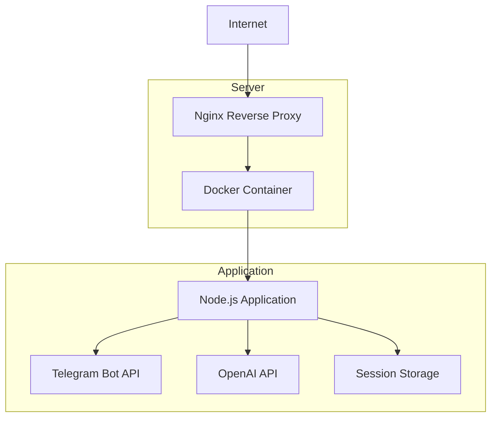
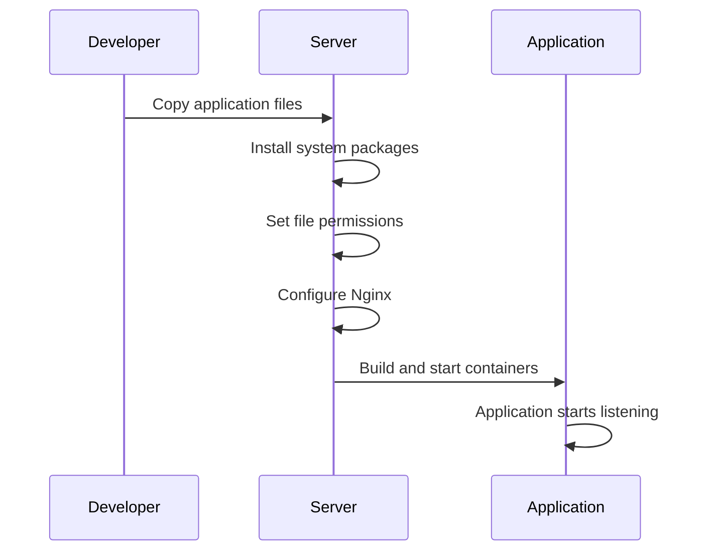

# Server Application Launch Design

## Overview

This document outlines the design for properly launching the Telegram Translation Bot server application with Docker containerization, secure configuration, and flexible deployment options. The design addresses previous deployment issues by implementing configurable port mapping, proper environment management, and streamlined deployment processes.

## Architecture

The application follows a containerized microservice architecture with the following components:



## Containerization Design

### Dockerfile Configuration

The Dockerfile implements security best practices:

- Uses Node.js 18 Alpine as the base image for lightweight containerization
- Implements non-root user execution for enhanced security
- Copies only necessary files to minimize attack surface
- Installs only production dependencies

```dockerfile
FROM node:18-alpine
WORKDIR /app
COPY package*.json ./
RUN npm ci --only=production
COPY . .
EXPOSE 3000
USER nextjs
CMD ["node", "src/index.js"]
```

### Docker Compose Configuration

The docker-compose.yml file provides flexible port configuration through environment variables:

```yaml
version: '3.8'
services:
  telegram-bot:
    build: .
    container_name: telegram-translation-bot
    ports:
      - "${HOST_PORT:-3000}:${CONTAINER_PORT:-3000}"
    env_file:
      - .env
    volumes:
      - ./logs:/app/logs
    restart: unless-stopped
```

## Environment Configuration

### Environment Variables

The application uses environment variables for all configuration:

| Variable | Description | Default |
|----------|-------------|---------|
| PORT | Application port | 3000 |
| HOST_PORT | Host port mapping | 3000 |
| CONTAINER_PORT | Container port | 3000 |
| TELEGRAM_BOT_TOKEN | Telegram bot authentication token | - |
| OPENAI_API_KEY | OpenAI API key | - |
| OPENAI_MODEL | OpenAI model to use | gpt-5-turbo |
| SESSION_EXPIRY_TIME | Session expiration time in ms | 86400000 |
| MAX_RETRIES | Max retry attempts for API calls | 3 |
| BASE_DELAY | Base delay for retry mechanism | 1000 |

## Deployment Process

### Automated Deployment

The deployment process uses scripts to automate server setup:

1. **File Transfer**: Application files are copied to the server
2. **Environment Setup**: System packages are installed and updated
3. **Permissions**: Secure file permissions are set for sensitive files
4. **Nginx Configuration**: Reverse proxy is configured with SSL
5. **Container Deployment**: Docker containers are built and started



### Port Conflict Resolution

The deployment scripts include automatic port conflict detection and resolution:

1. Check if the configured port is already in use
2. If in use by Docker container, stop the container
3. If in use by other process, kill the process
4. Wait for port to be released before proceeding

## Security Considerations

### Container Security

- Application runs as non-root user inside container
- Environment variables are stored securely with proper file permissions (600)
- Only production dependencies are installed in the container

### Network Security

- SSL encryption for all external communications
- Nginx reverse proxy terminates SSL connections
- Application is not directly exposed to the internet

### Access Control

- Telegram bot token is stored as environment variable
- OpenAI API key is stored as environment variable
- File permissions are restricted to authorized users only

## Monitoring and Maintenance

### Health Checks

- Application exposes `/health` endpoint
- Monitor container status with `docker-compose ps`
- Check logs with `docker-compose logs`

### SSL Certificate Management

- Certbot automatically sets up renewal cron job
- Test renewal with `certbot renew --dry-run`

### Application Updates

1. Pull latest code from repository
2. Rebuild Docker image: `docker-compose build`
3. Restart containers: `docker-compose up -d`

## Error Handling and Recovery

### Deployment Failures

- Scripts check for required files before deployment
- Environment variables are validated before starting containers
- Port conflicts are automatically resolved

### Runtime Failures

- Application logs are persisted to volume-mounted directory
- Docker restart policy ensures application recovery
- Health checks can trigger alerts for persistent failures

## Testing Strategy

### Pre-deployment Validation

- Verify all required deployment files exist
- Check Dockerfile for security best practices
- Validate docker-compose.yml syntax
- Confirm nginx.conf configuration

### Post-deployment Verification

- Check container status
- Verify application logs
- Test Telegram bot functionality
- Confirm SSL certificate validity

## Rollback Plan

In case of deployment issues:

1. Stop current containers: `docker-compose down`
2. Restore previous version from backup
3. Revert nginx configuration
4. Restart containers with previous version

## Performance Considerations

### Resource Allocation

- Alpine base image minimizes resource usage
- Volume mounting for logs prevents container size growth
- Restart policy ensures high availability

### Scalability

- Session storage can be externalized for horizontal scaling
- Multiple container instances can run behind load balancer
- Nginx can handle connection pooling and load distribution