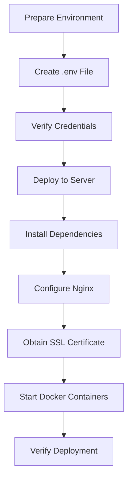

# Telegram Translation Bot Production Deployment Design

## 1. Overview

This document outlines the deployment design for the Telegram Translation Bot, ensuring it functions as a production-ready application that integrates with the OpenAI API using the GPT-5-nano model and connects to Telegram for user interactions.

### 1.1 Purpose
To deploy a fully functional Telegram Translation Bot that:
- Uses GPT-5-nano model via OpenAI API for translation
- Integrates with Telegram Bot API for user interactions
- Provides real-time multilingual translation between any combination of supported languages (English, Russian, and Korean)
- Implements robust error handling and session management

### 1.2 Key Requirements
- Application must be accessible at https://anna.floripa.br
- Must use GPT-5-nano model for all LLM operations
- Must properly handle Telegram bot token for user communication
- Must implement proper security measures for API keys
- Must provide health monitoring and logging capabilities

## 2. Architecture

```mermaid
graph TD
    A[Telegram User] --> B[Telegram API]
    B --> C[Telegram Translation Bot]
    C --> D[OpenAI API (GPT-5-nano)]
    C --> E[Docker Container]
    E --> F[Nginx Reverse Proxy]
    F --> G[Internet]
    H[Administrator] --> I[Health Endpoint]
    I --> C
```

### 2.1 Components
1. **Telegram Bot Interface**: Uses Telegraf.js to interact with Telegram API
2. **Translation Service**: Orchestrates translation pipeline using GPT-5-nano
3. **LLM Client**: Handles communication with OpenAI API
4. **Session Manager**: Maintains user language preferences
5. **Docker Container**: Packages application for deployment
6. **Nginx Reverse Proxy**: Handles SSL termination and routing
7. **Health Monitoring**: Provides endpoint for monitoring application status

### 2.2 Data Flow
1. User sends message to Telegram bot
2. Telegram API forwards message to bot webhook
3. Bot processes message through translation pipeline:
   - Language setup (if needed)
   - Source language detection
   - Translation to target languages
4. Responses sent back through Telegram API to user

## 3. Deployment Environment

### 3.1 Server Configuration
- **IP Address**: 31.97.173.218
- **Domain**: anna.floripa.br
- **Operating System**: Ubuntu 20.04 LTS (recommended)
- **Required Packages**: 
  - Docker
  - Docker Compose
  - Nginx
  - Certbot

### 3.2 Container Configuration
- **Base Image**: Node.js 18 Alpine
- **Working Directory**: /app
- **User**: Non-root user (nextjs) for security
- **Port**: 3000 (container), 3000 (host)
- **Restart Policy**: unless-stopped

### 3.3 Environment Variables
| Variable | Description | Required |
|----------|-------------|----------|
| TELEGRAM_BOT_TOKEN | Telegram bot authentication token | Yes |
| OPENAI_API_KEY | OpenAI API key for GPT-5-nano | Yes |
| OPENAI_MODEL | Model to use (gpt-5-nano) | Yes |
| PORT | Application port (3000) | Yes |
| SESSION_EXPIRY_TIME | Session expiration in milliseconds | No |
| MAX_RETRIES | Max retry attempts for LLM calls | No |
| BASE_DELAY | Base delay for exponential backoff | No |

## 4. Security Design

### 4.1 API Key Management
- API keys stored in .env file with 600 permissions
- Keys not committed to version control
- Keys injected at runtime via Docker environment

### 4.2 Container Security
- Application runs as non-root user
- Minimal base image (Alpine Linux)
- Only production dependencies installed

### 4.3 Network Security
- Nginx reverse proxy handles SSL termination
- HTTPS enforced via redirect
- Docker container isolated from host network

## 5. Deployment Process

### 5.1 Prerequisites
1. Telegram bot token from BotFather
2. OpenAI API key with GPT-5-nano access
3. SSH access to server (root@31.97.173.218)
4. Domain name (anna.floripa.br) pointing to server IP

### 5.2 Deployment Steps


### 5.3 Detailed Deployment
1. **Environment Setup**
   - Copy .env.example to .env
   - Update TELEGRAM_BOT_TOKEN and OPENAI_API_KEY
   - Set OPENAI_MODEL to gpt-5-nano in the .env file
   - Example .env configuration:
     ```
     # Server Configuration
     PORT=3000
     
     # Telegram Bot Configuration
     TELEGRAM_BOT_TOKEN=your_actual_telegram_bot_token_here
     
     # OpenAI Configuration
     OPENAI_API_KEY=your_actual_openai_api_key_here
     OPENAI_MODEL=gpt-5-nano
     
     # Session Configuration
     SESSION_EXPIRY_TIME=86400000
     
     # Retry Configuration
     MAX_RETRIES=3
     BASE_DELAY=1000
     ```

2. **Server Deployment**
   - Create /opt/telegram-translation-bot directory
   - Copy all application files to server
   - Set proper permissions on .env file

3. **Dependency Installation**
   - Install Docker, Docker Compose, Nginx, Certbot
   - Update system packages

4. **Nginx Configuration**
   - Copy nginx.conf to /etc/nginx/sites-available/
   - Create symbolic link to sites-enabled
   - Test and reload Nginx configuration

5. **SSL Certificate**
   - Obtain certificate using Certbot
   - Configure automatic renewal

6. **Container Deployment**
   - Build Docker image
   - Start containers with docker-compose up -d
   - Verify container status

## 6. Monitoring and Maintenance

### 6.1 Health Checks
- **Endpoint**: https://anna.floripa.br/health
- **Metrics**: Uptime, session count, timestamp
- **Monitoring**: Container status, log analysis

### 6.2 Log Management
- **Error Logs**: /opt/telegram-translation-bot/logs/error.log
- **Combined Logs**: /opt/telegram-translation-bot/logs/combined.log
- **Docker Logs**: docker-compose logs -f

### 6.3 Model Verification
To verify that the application is using the GPT-5-nano model:
1. Check Docker container logs for LLM calls: `docker-compose logs | grep -i "gpt-5-nano"`
2. Verify environment variable: `docker-compose exec telegram-bot env | grep OPENAI_MODEL`
3. Test translation functionality and check logs for model information

### 6.4 Updates
1. Pull latest code from repository
2. Rebuild Docker image: docker-compose build
3. Restart containers: docker-compose up -d

## 7. Troubleshooting

### 7.1 Common Issues
| Issue | Solution |
|-------|----------|
| Bot not responding | Verify Telegram token validity |
| Translation failures | Check OpenAI API key and quota |
| Connection issues | Check firewall and network config |
| SSL errors | Verify certificate validity |

### 7.2 Port Conflicts
- **Detection**: Check if port 3000 is in use
- **Resolution**: Stop conflicting processes or change port mapping
- **Prevention**: Use environment variables for flexible configuration

## 8. Testing Validation

### 8.1 Pre-deployment Tests
- [ ] All required files present
- [ ] Dockerfile configuration valid
- [ ] docker-compose.yml port mapping correct
- [ ] Nginx configuration valid
- [ ] Environment variables configured

### 8.2 Post-deployment Tests
- [ ] Application accessible at https://anna.floripa.br
- [ ] Health endpoint returns valid JSON
- [ ] Telegram bot responds to /start command
- [ ] Language setup works with natural language input
- [ ] Translation works between all supported languages
- [ ] Application is using GPT-5-nano model for translations

## 9. Rollback Plan

### 9.1 If Deployment Fails
1. Check server connectivity and SSH access
2. Verify all required environment variables are set, especially OPENAI_MODEL is set to gpt-5-nano
3. Ensure no processes are already using port 3000
4. Check system resources on the server

### 9.2 Application Issues After Deployment
1. Check Docker container logs: docker-compose logs
2. Verify environment variables: docker-compose exec telegram-bot env
3. Check Nginx configuration: nginx -t
4. Review system logs: /var/log/syslog