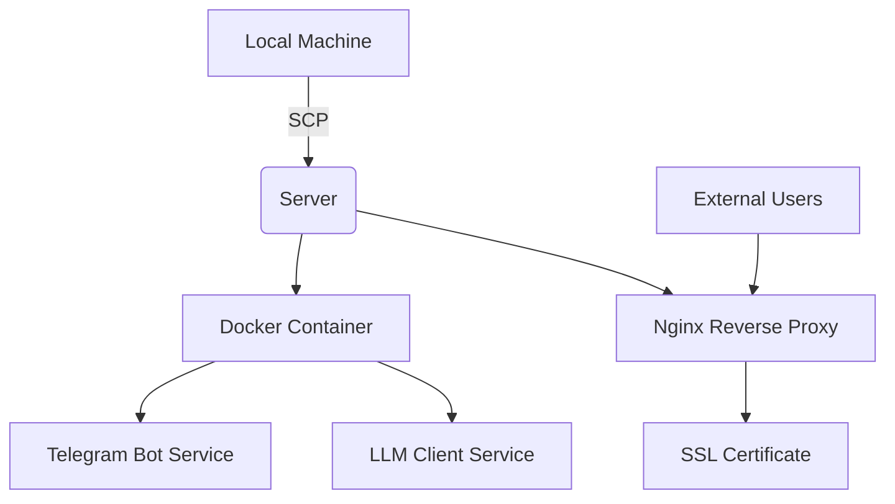

# Telegram Translation Bot Deployment Continuation Plan

## Overview
This document outlines the steps to continue the deployment of the Telegram Translation Bot to the remote server (31.97.173.218) after an internet interruption. The deployment process involves copying application files, setting up the environment, configuring SSL certificates, and starting the Docker containers.

## Current Deployment Status Analysis
Based on the deployment scripts and documentation, the deployment process includes:
1. Preparing environment variables in a `.env` file
2. Copying application files to the server
3. Installing required packages (Docker, Docker Compose, Nginx, Certbot)
4. Configuring Nginx reverse proxy
5. Obtaining SSL certificates
6. Building and starting Docker containers

Since the internet connection was interrupted, we need to determine which steps were completed and which need to be restarted.

## Deployment Architecture


## Prerequisites for Continuation
1. SSH access to server: `ssh root@31.97.173.218`
2. Valid `.env` file with:
   - TELEGRAM_BOT_TOKEN
   - OPENAI_API_KEY
3. Internet connectivity

## Deployment Continuation Steps

### Step 1: Verify Server Connection and Current State
```bash
# Connect to server
ssh root@31.97.173.218

# Check if application directory exists
ls -la /opt/telegram-translation-bot/

# Check if Docker is installed
docker --version
docker-compose --version

# Check if Nginx is installed
nginx -v

# Check if Certbot is installed
certbot --version
```

### Step 2: Resume File Transfer (if needed)
If the previous file transfer was interrupted, we need to copy the application files:

```bash
# From local machine
scp -r ./* root@31.97.173.218:/opt/telegram-translation-bot/
```

### Step 3: Verify Environment Configuration
```bash
# On the server, check if .env file exists and has correct permissions
ssh root@31.97.173.218
cd /opt/telegram-translation-bot/
ls -la .env

# Check that the .env file contains required variables
cat .env
```

### Step 4: Resume System Package Installation (if needed)
```bash
# On the server
ssh root@31.97.173.218

# Update system packages
apt update && apt upgrade -y

# Install required packages (will skip already installed packages)
apt install -y docker.io docker-compose nginx certbot python3-certbot-nginx
```

### Step 5: Configure Nginx Reverse Proxy
```bash
# On the server
ssh root@31.97.173.218

# Copy Nginx configuration
cp /opt/telegram-translation-bot/nginx.conf /etc/nginx/sites-available/telegram-translation-bot
ln -sf /etc/nginx/sites-available/telegram-translation-bot /etc/nginx/sites-enabled/

# Test Nginx configuration
nginx -t

# Reload Nginx if configuration is valid
systemctl reload nginx
```

### Step 6: Obtain SSL Certificate (if needed)
```bash
# On the server
ssh root@31.97.173.218

# Obtain SSL certificate for domain (will skip if already exists)
certbot --nginx -d anna.floripa.br --non-interactive --agree-tos --email admin@anna.floripa.br
```

### Step 7: Build and Start Docker Containers
```bash
# On the server
ssh root@31.97.173.218

# Navigate to application directory
cd /opt/telegram-translation-bot

# Set proper permissions for environment file
chmod 600 .env

# Create logs directory if it doesn't exist
mkdir -p logs

# Build and start containers
docker-compose up -d

# Check container status
docker-compose ps

# Check logs
docker-compose logs -f
```

## Health Check and Verification

### Application Health Endpoints
- Health check: `https://anna.floripa.br/health`
- Main endpoint: `https://anna.floripa.br/`

### Container Status Verification
```bash
# On the server
docker-compose ps
docker stats
```

### Log Monitoring
```bash
# On the server
docker-compose logs -f
tail -f /var/log/nginx/access.log
tail -f /var/log/nginx/error.log
```

## Troubleshooting Common Issues

### Issue 1: File Transfer Incomplete
**Symptoms**: Missing files in `/opt/telegram-translation-bot/`
**Solution**: Re-run the SCP command to transfer all files

### Issue 2: Environment Variables Not Set
**Symptoms**: Application fails to start or doesn't respond
**Solution**: Verify `.env` file exists and contains valid credentials

### Issue 3: SSL Certificate Issues
**Symptoms**: Browser shows security warnings
**Solution**: Re-run Certbot command or check certificate status

### Issue 4: Docker Container Failures
**Symptoms**: Containers not running or crashing
**Solution**: Check logs with `docker-compose logs` and verify environment variables

### Issue 5: Nginx Configuration Problems
**Symptoms**: Server returns 502 Bad Gateway or similar errors
**Solution**: Check Nginx configuration and reload service

## Rollback Plan
If deployment fails:
1. Stop Docker containers: `docker-compose down`
2. Remove Nginx configuration: `rm /etc/nginx/sites-enabled/telegram-translation-bot`
3. Reload Nginx: `systemctl reload nginx`
4. Restore previous backup if available

## Security Considerations
1. Environment file permissions set to 600 (owner read/write only)
2. Application runs as non-root user inside container
3. SSL encryption for all external communications
4. Regular updates for system packages and Docker images

## Post-Deployment Tasks
1. Test Telegram bot functionality
2. Verify translation service is working
3. Set up monitoring for container health
4. Configure automated SSL certificate renewal
5. Set up log rotation for application logs